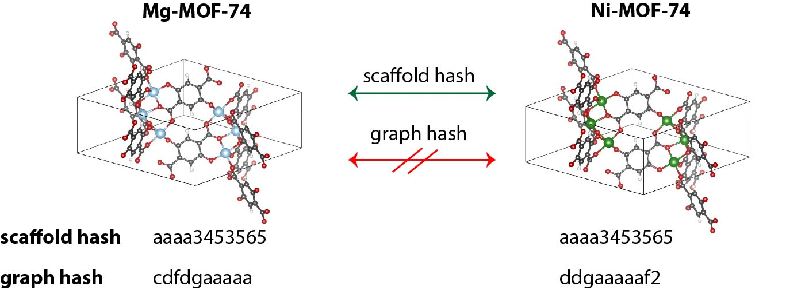
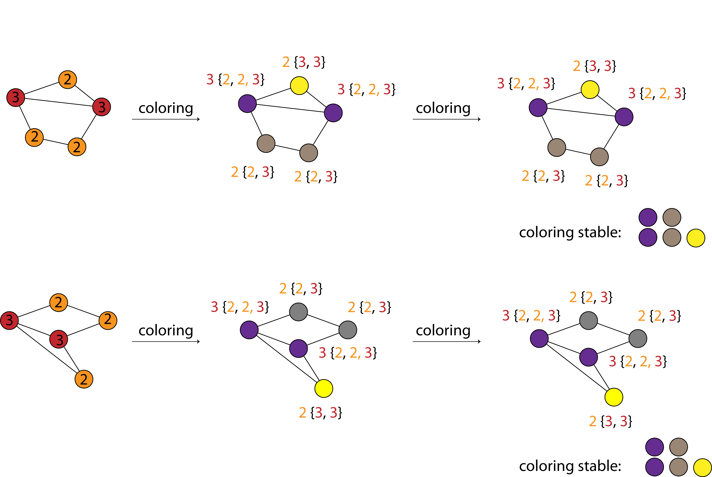

Background information about the checks
=========================================

Porosity check
----------------
`Potential porosity <https://blogs.rsc.org/ce/2013/01/08/iupac-provisional-recommendations-on-metal-organic-framework-and-coordination-polymer-terminology/?doing_wp_cron=1616568093.4138350486755371093750>`_ is thought to be a key defining criterion for MOFs.
For assembling the widely used CoRE-MOF database (see `first <https://pubs.acs.org/doi/10.1021/cm502594j>`_ and `second <https://pubs.acs.org/doi/10.1021/acs.jced.9b00835>`_ paper) Yongchul G. Chung et al. used a pore limiting diameter (PLD) of more than 2.4 Å (approximately the van der Waals diameter of a hydrogen molecule) as threshold for the distinction of porous and non-porous (or nanoporous) MOFs.

In mofchecker, we follow this definition and use `zeopp <http://www.zeoplusplus.org/>`_ with the high-accuracy flag and the default atom radii to compute the largest free sphere. If it is above or equal to 2.4 Å the :py:obj`~mofchecker.MOFChecker.is_porous` will return :code:`True`.

Charge check
--------------
The charge check is quite a simple heuristic that will raise an error if a simple charge equilibration method (see J. Chem. Theory Comput. 2019, 15, 1, 382–401 for background) yields high (>4) charges. Often, this correlates with "wrong", or at least, unusual chemistry. Has been used as a check in  Nat Commun 11, 4068 (2020).

Clashing atoms
-----------------
The check for clashing atoms is based on a simple distance-based criterion. That is, for and atomic distance smaller than the minimum covalent radius of one of the bonding partners, we will raise an error.

Over/undercoordinated C/N
----------------------------
The checks for over/undercoordination are based on simple, hard-coded heuristics on bond angles and coordination numbers and are far from being general and comprehensive.

Graph hash and scaffold hash
----------------------------

For a given MOF structure

* the undecorated graph hash (:py:attr:`~mofchecker.MOFChecker.undecorated_graph_hash`) is unique for a given connectivity (bond network), independent of the atomic species in the graph
* the structure graph hash (:py:attr:`~mofchecker.MOFChecker.graph_hash`) is like the undecorated graph hash, but also considers the atomic elements (nodes) in the graph
*  the undecorated scaffold hash (:py:attr:`~mofchecker.MOFChecker.undecorated_scaffold_hash`) is unique for a given connectivity (bond network), independent of the atomic species in the graph, ignoring the small subgraphs one obtains when breaking edges (i.e. removing solvents, functional groups, etc.)
* the decorated scaffold hash (:py:attr:`~mofchecker.MOFChecker.decorated_scaffold_hash`) is like the undecorated scaffold hash, but also considers the atomic elements (nodes) in the graph
* the symmetrized structure hash (:py:attr:`~mofchecker.MOFChecker.symmetry_hash`) hashes the space group and the set of Wyckoff symbols

What is it useful for?
......................

The scaffold and structure graph hashes allow to quickly identify duplicates in large structure databases.

The concept of duplicate structures, as defined by comparing their :py:attr:`~mofchecker.MOFChecker.graph_hash`, closely follows the one proposed by `Barthel et al. <https://pubs.acs.org/doi/pdf/10.1021/acs.cgd.7b01663>`_ :

    [...], from a MOF point of view two structures are considered identical if they share the same bond network, with respect to the atom types and their embedding:
    i.e., if two structures can in principle be deformed into each other without breaking and forming bonds.

The undecorated hash can be useful to find families of related MOFs.
For example, all members of the (unfunctionalized) MOF-74 family, such as Ni-MOF-74 or Mg-MOF-74, group under the same hash.

How does it work?
....................

mofchecker

#. symmetrizes the cell using `pymatgen <http://pymatgen.org/>`_ and `spglib <https://spglib.github.io/spglib/>`_ (use :code:`symprec=None, angle_tolerance=None` to disable this)
#. analyzes the bonding network and creates a corresponding structure graph using `pymatgen <http://pymatgen.org/>`_ (use :py:meth:`~mofchecker.MOFChecker._set_cnn` to switch to a different bond analysis method).
#. computes the Weisfeiler-Lehman hash of the structure graph using `networkx <https://networkx.org/>`_.

The Weisfeiler Lehman algorithm is explained in the `English translation of the original paper <https://www.iti.zcu.cz/wl2018/pdf/wl_paper_translation.pdf>`_
and a `popular blog post <https://davidbieber.com/post/2019-05-10-weisfeiler-lehman-isomorphism-test/#:~:text=The%20core%20idea%20of%20the,used%20to%20check%20for%20isomorphism>`_.
The figure below (adopted from `Michael Bronstein's blog <https://towardsdatascience.com/expressive-power-of-graph-neural-networks-and-the-weisefeiler-lehman-test-b883db3c7c49>`_) illustrates the concept:

Briefly:

#. Start by labelling each atom (node) with its atomic number (`graph_hash`) or the number of its connected neighbors (`scaffold_hash`).
#. Extend the labels with the labels of the nearest neighbors. Color nodes according to their labels.
#. Continue until coloring converges or the maximum number of iterations is reached (we find that 3rd-nearest neighbors is enough)
#. Create a histogram of colors of all nodes and return a (ideally unique) hash of it.

What can go wrong?
....................

Hashes of two structures may *differ unexpectedly* if

*  The two structures were not reduced to the same primitive cell. This can happen when the symmetry in one of the structures is broken.
*  The bonding network of the two structures is not the same. Bonds between atoms are assigned based on heuristics; you may want to try a different method using :py:meth:`~mofchecker.MOFChecker._set_cnn`.

It is also possible (but unlikely) that the hashes of two structures *coincide unexpectedly* if

* there is an unlucky hash clash.
  Weisfeiler Lehman has some `edge cases <https://informaconnect.com/beyond-weisfeiler-lehman-using-substructures-for-provably-expressive-graph-neural-networks/>`_)

* the structure graph heuristics did not work, i.e., we assigned wrong bonds to the structure.

To double-check the hash results it can be practical to also consider simple factors such as density and composition.
